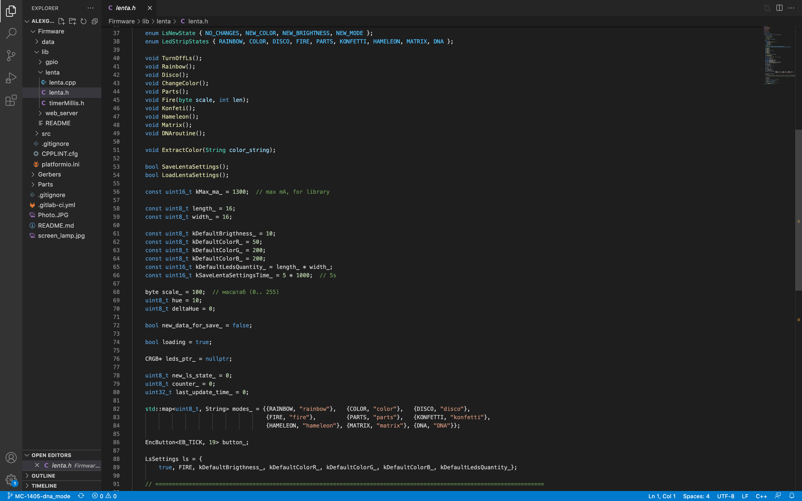
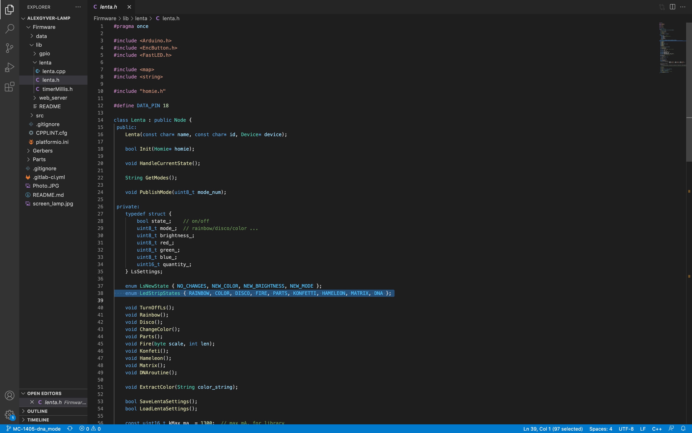
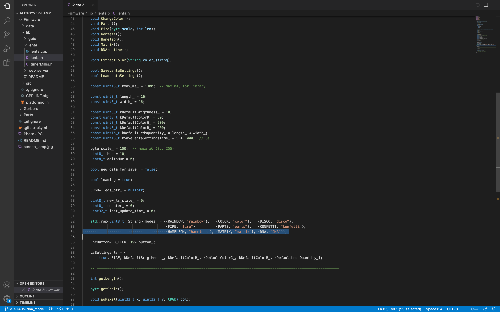
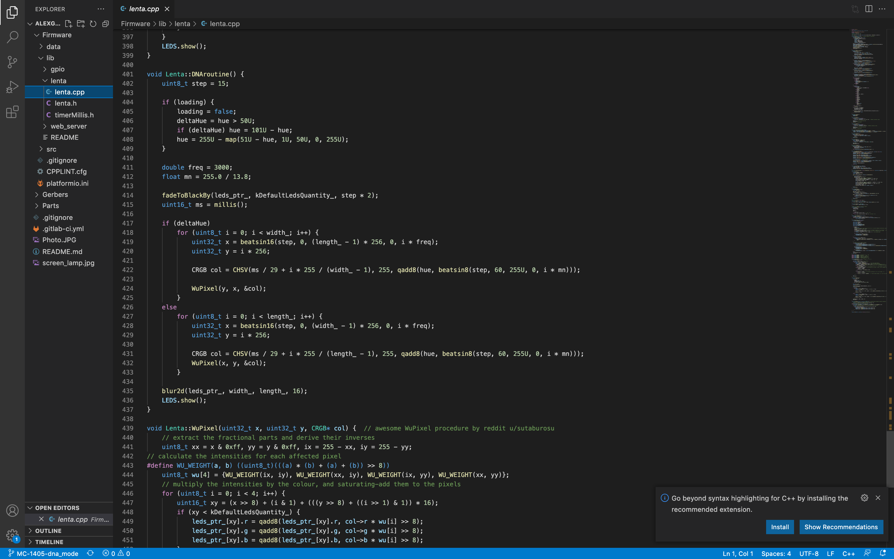
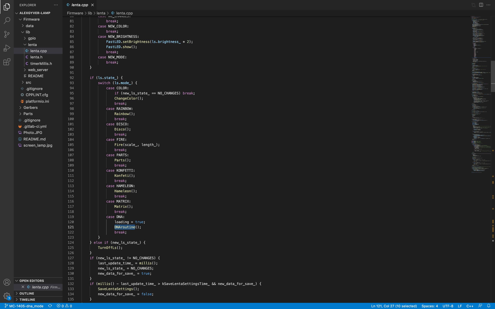

## How to create custom effects on "DNA" example

For adding custom effects to this firmwate you need to:
  
1. Clone the project using ```git clone``` to local machine.
   
2. Create the new brnach and add your changes:
   a) add method of your effect in `lib/lenta/lenta.h`

   
   
   b) add the effect name into `LedStripStates`
   
   

   c) attach effect name for mobile application in `modes_`

   

   
   d) add the body of the method with a description of all the logic of the effect in `lib/lenta/lenta.cpp` . Add helper methods if needed.

   *Attention! Do not forget that LED lighting is also a mode task for which the `LEDS.show ();` command must be used.*
      
   e) add effect to switch in `HandleCurrentState`

   

   f) build the firmware with the ```pio run``` command (in this case, you need to be in the Firmware folder).

   

  *Attention! Write firmware to controller only with disconnected Led Matrix or use OTA update via web admin panel.*
  
  Ready-to-upload `firmware.bin` will be in the `Firmware/.pio/build/esp32dev` folder (enadle hidden files to find it) after running the ```pio run``` or [writing the firmare to device](Firmware-Uploading.md).


   
   
  


