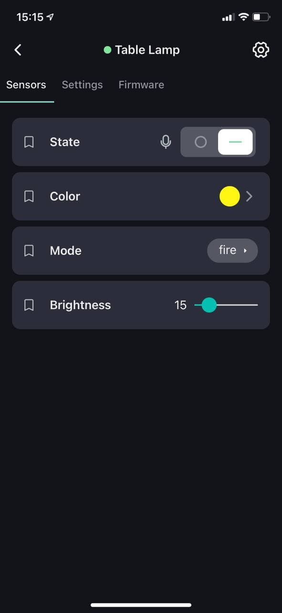
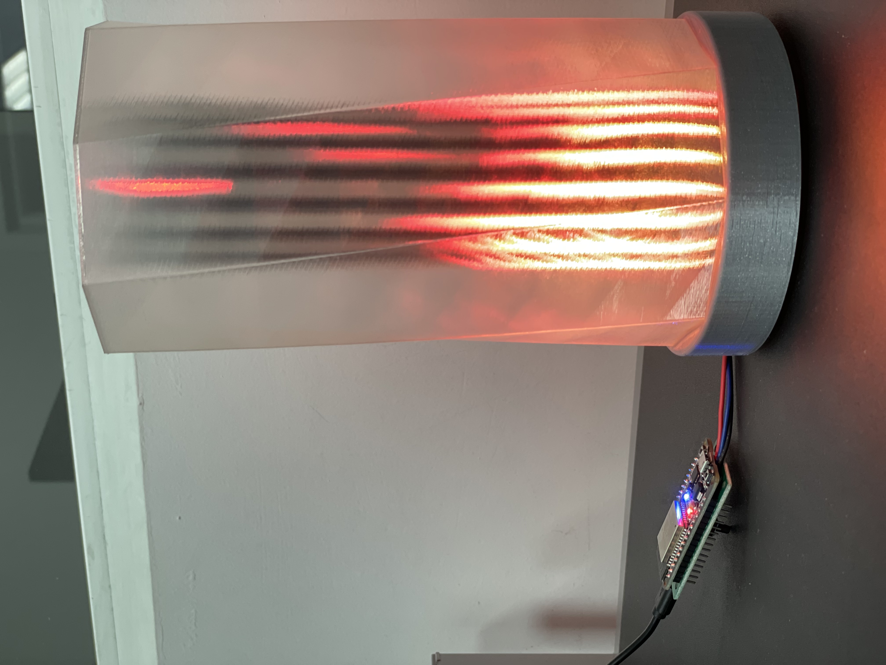

## 2Smart Gyver Lamp
A custom controller for controlling an addressable LED matrix based on an ESP32 microcontroller. Ideal for assembling a fire lamp type device from [AlexGyver](https://alexgyver.ru/gyverlamp/). The device supports full integration with the mobile application [2Smart Cloud](https://2smart.com) on [IOS](https://apps.apple.com/ru/app/2smart-cloud/id1539188825) and [Android](https://play.google.com/store/apps/details?id=com.smart.microcloud.app&hl=ru&gl=US). 

With the help of the mobile application, you will be able to:
- connect the device to your account;
- switch the state of the LED strip;
- switch operating modes;
- control the brightness;
- receive notifications;
- update the device firmware;
- control the device using voice assistants, telegram bot, phone calls;
- share access to device control with other users through a mobile application or a temporary link.

In addition to the control capabilities via a mobile application, the device has a full-fledged web interface available at the default address http://192.168.4.1 or at the device's address in the local network.


Materials for printing your own boards and accessories for the device can be found in the corresponding folders of this repository. [3d model](https://www.thingiverse.com/thing:3917465) of the printed case was taken from a public source, but any other case from custom components can be used.

The device firmware is developed based on the public [2Smart Cloud SDK](https://github.com/2SmartCloud/2smart-cloud-esp32-boilerplate) for ESP32.

### Connecting to the mobile application
After installing the firmware on the device, you need to install the mobile application [2Smart Cloud](https://2smart.com) and register. Then find the 2Smart Gyver Lamp in the device market and follow the connection instructions. 






## How to write firmware on device


Go to your project folder, and then go to the firmware folder, in this folder open a command prompt.

1. Need have:  
     `python` (>= v3) installed. You can control it in terminal      
    ```
    python --version
    ```    

    `platformio` (>= v5.1.1)
    ```
    pip install -U platformio
    ```    

2. Have connected device to your computer.

3. Device should be listed in /dev as one of this:

    ```
    (Linux)
    /dev/ttyUSB0

    (OSX)
    /dev/cu.SLAB_USBtoUART
    /dev/cu.usbserial-0001
    ```

4. build and write

    ```
    pio run -t uploadfs
    pio run -t upload
    ```

5. If everything is okay it should start in AP mode and blink once in a second.

If you want just build 
    ```
    pio run 
    ```
If you have error "can't open device "/dev/ttyUSB0": Permission denied" follow Link https://qna.habr.com/q/526674

CLI guide https://docs.platformio.org/en/latest/core/userguide/index.html

## Physical control

To turn on the lamp, tap and hold the top of the device for a second.
To switch the lamp modes, touch the top of the device. The modes are switched sequentially each time you press.
To turn off the lamp, tap and hold the top of the device for a second.
To reset the lamp settings, use the “Reset” button located at the bottom of the device. Use a paperclip or similar object to press the button.

## Custom firmware

Fill free to fork this firmware and create you own products with custom functionality.
Detailed instruction you could find in our [blog](https://2smart.com/blog/tpost/ebvsii6y21-how-to-write-firmware-for-an-iot-device).

## To Do
* [ ] Add more modes
* [ ] Add sheduled commands

